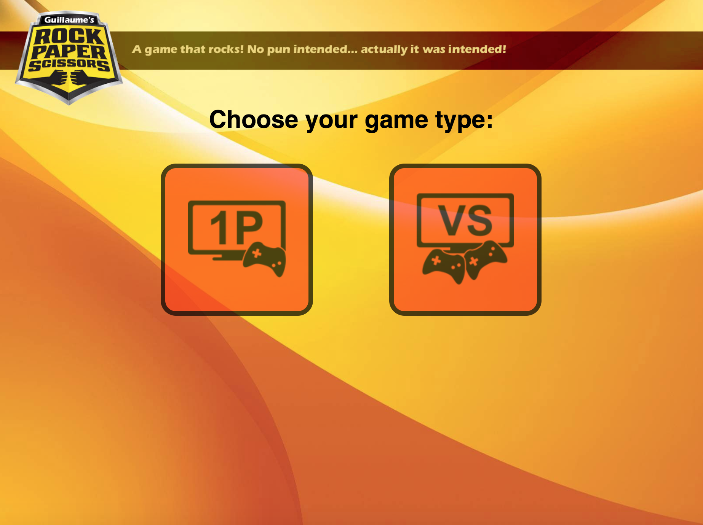
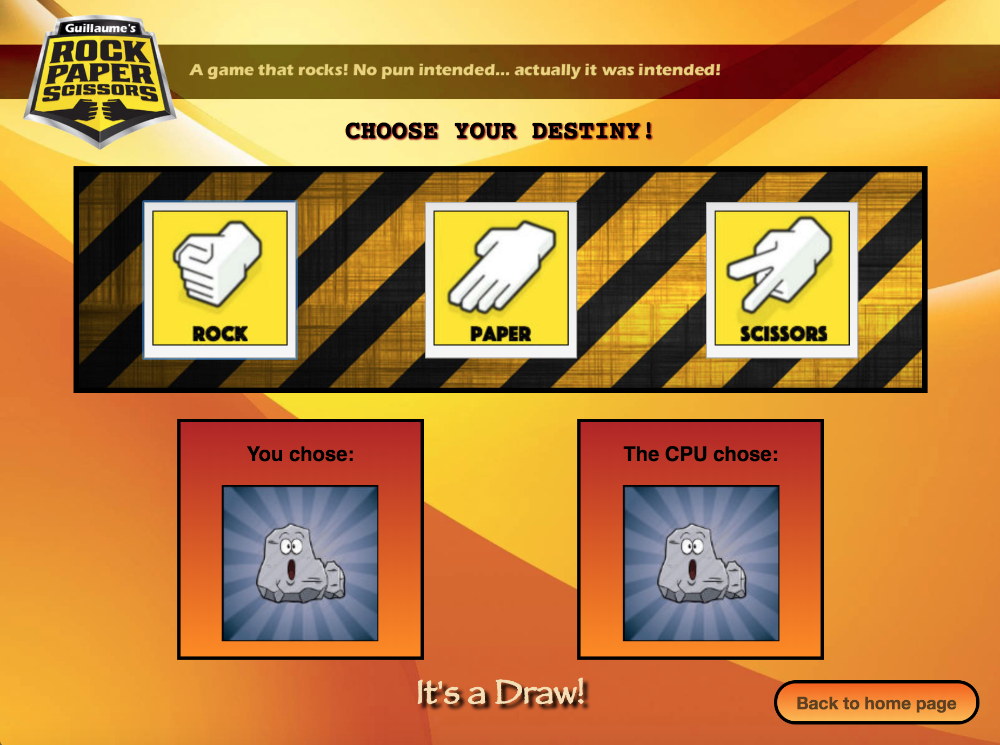
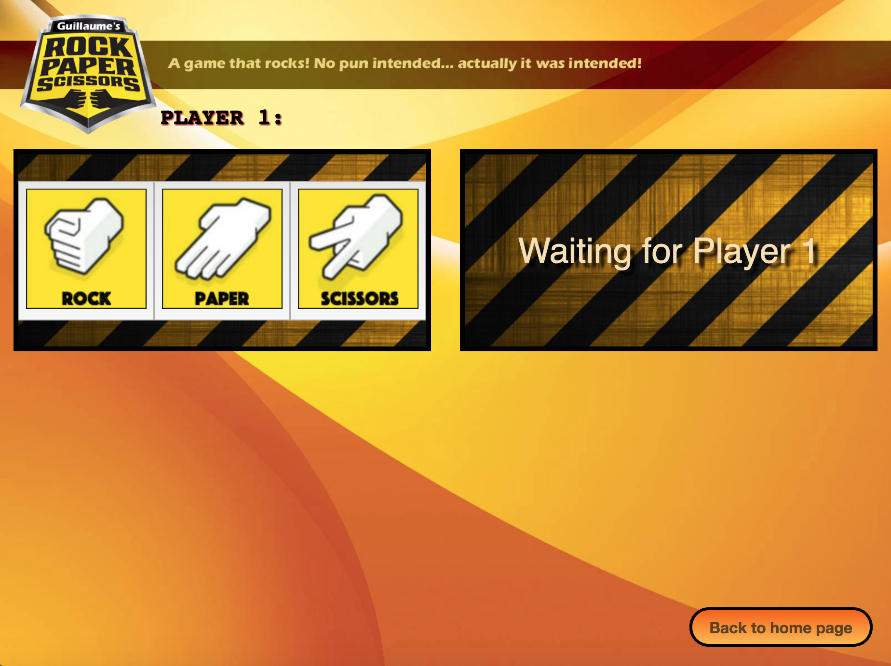
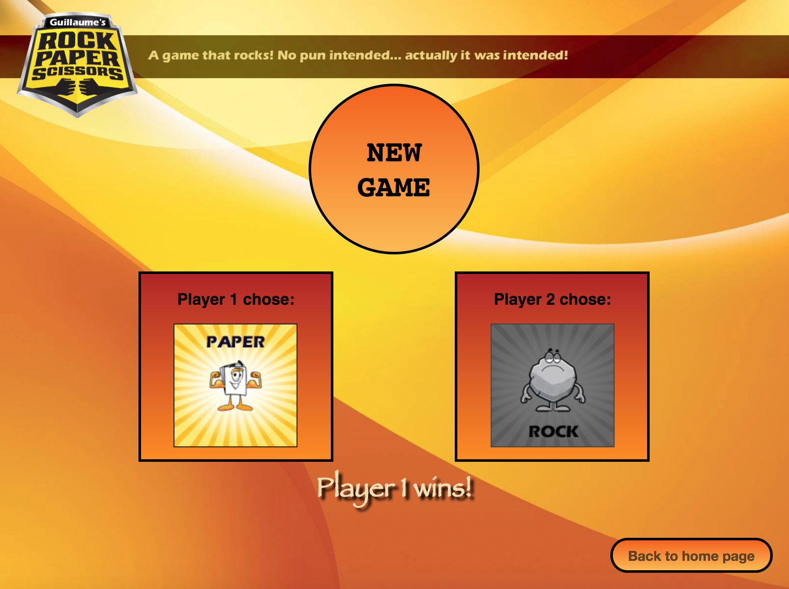

[](https://travis-ci.org/GBouffard/rock-paper-scissors) (Continuous Integration through Travis CI)

:moyai: Rock :page_with_curl: Paper :scissors: Scissors
===
This is Guillaume's Rock, Paper, Scissors game:

Main functionalities:
- 1 player game and 2 players game modes are available.
- Each player is presented between choices of Rock, Paper and Scissors.
- In the case of a 1 player game, results are show right away.
- In the case of a 2 players game, results are only shown when both players made their choices.
- A winner is declared at the end of each match-up.

Technologies used:
----
- JavaScript
- ES6 syntax
- create-react-app
- React
- React-Dom
- React-router & React-router-dom
- PropTypes
- classNames
- BEM
- HTML
- CSS
- Flexbox
- React-media
- Jest
- Pa11y
- cookies

Desktop preview:
----









How to run it:
----
- General Use:
```
git clone git@github.com:GBouffard/rock-paper-scissors.git
cd rock-paper-scissors
./build.sh
```
PS: the script will ask to chose options regarding running Jest tests; Press a to run all tests, then q to quit the test suite.

- Test accessibility
```
npm run test-accessibility
```

- Show the hidden feature:
If you want to see the hidden dashboard, you will need to add:
```
document.cookie="showDashboard=true"
```
within your console and refresh your client.

Deployment link (Github Pages:
----
[Guillaume's Rock Paper Scissors](https://gbouffard.github.io/rock-paper-scissors/)


Methodology:
----
- I first scaffolded the app through react-create-app.
- I started with unit logic tests and based the game logic on how it is supposed to work.
- I then started with a 1 player game; and further down the line moved to a 2 players game.
- I then applied responsive design using react-media
- I also tested accessibility using Pa11y
- The React code is gearing towards re-usability.
- Travis CI is being us as continuous integration tool; insuring that the build is passing.
- I also added a hidden feature behind a cookie.

What I learnt:
----
- I used the React-router Redirect command for the first time.
- I wrote a shell script for the first time.

What to improve:
----
- The logic of the game is unit tested however for some reasons the enzyme, react-test-renderer and Chai set-up conflicted; answers found on StackOverflow and Github didn't resolve so after a while, instead of blocking I had to skip integration tests and delay that part of the debugging to later. I have investigated other testing frameworks to use for functional tests but didn't have the time to try them yet.
- The whole CSS and Flexbox integration can be improved.
- sass or less compiling could also be added.
- Component state is fine as a MVP, but an application architecture such as Flux or Redux would be a great addition.
- The project is still open and I will keep improving it as I find the time to. Suggestions are more than welcome.